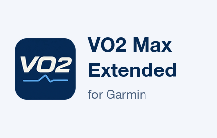
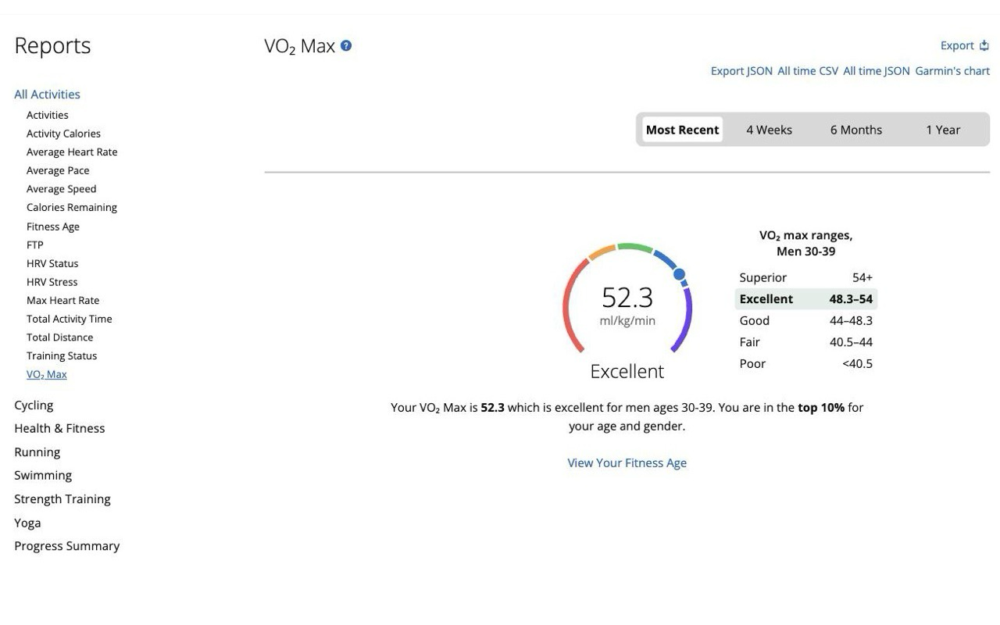
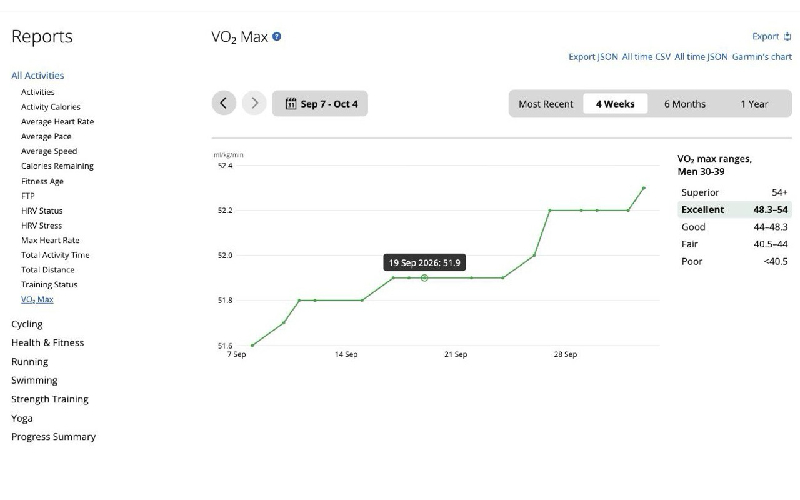
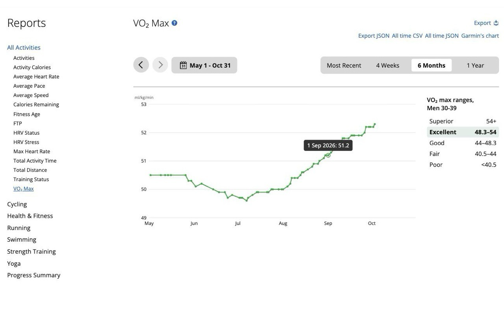
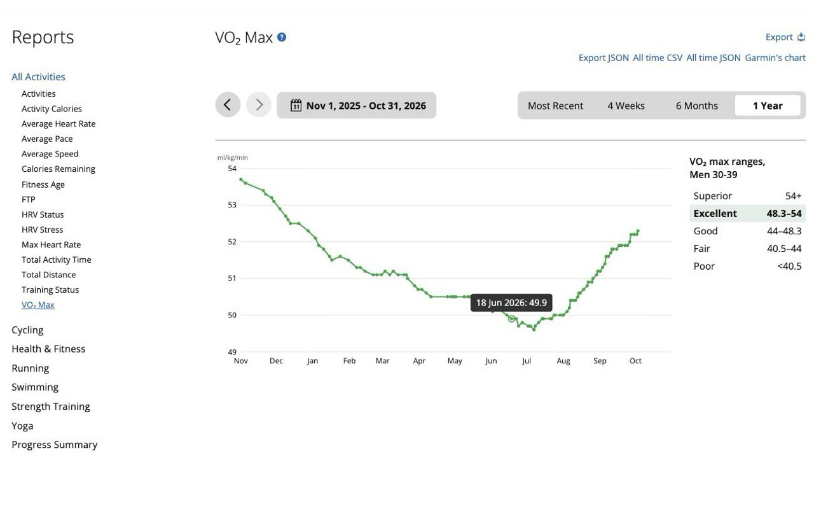

# VO2 Max Extended for Garmin

Garmin knows your VO2 max to one decimal place, but Garmin Connect shows it rounded to a whole
number and plots only a few points on its chart. This free browser extension shows the number
Garmin actually has, so 52 becomes 52.3.

## Install

- Chrome: [Chrome Web Store](https://chromewebstore.google.com/detail/vo2-max-extended-for-garm/fhmjdcflefibdfpdmlmakacjpjhijihj)
- Firefox: [Firefox Add-ons](https://addons.mozilla.org/en-US/firefox/addon/vo2-max-extended-for-garmin/)

Then sign in to Garmin Connect in the same browser and open the VO2 Max report. There is nothing
to set up. You need a Garmin Connect account with VO2 max data, which means a watch that
estimates it.

## What you get

### The precise value

On the Most Recent tab and on the home page, the rounded number is replaced by the precise one.
Hover it to see Garmin's rounded value. Beside the gauge is a list of VO2 max ranges (Superior to
Poor) for your age and sex, with your current category highlighted.

### A daily chart

On the 4 Weeks, 6 Months and 1 Year tabs, Garmin's chart is replaced by one with a point for
every day that has data. Hover a point for the date and value. The ranges list sits to the right.
The "Garmin's chart" button switches back to Garmin's own chart whenever you want.

### Exports that keep the decimals

Garmin's Export button is replaced by a CSV of the range you are viewing with the precise values.
Next to it are Export JSON, All time CSV and All time JSON buttons.

## Good to know

- It is unofficial. This project is not affiliated with, endorsed by or sponsored by Garmin Ltd.
  Garmin and Garmin Connect are trademarks of Garmin Ltd.
- It relies on Garmin Connect's undocumented web endpoints, so a change on Garmin's side can break
  it. If something stops working, please [open an issue](https://github.com/johnhumphrys/vo2-max-precise-extended/issues).
- The chart and ranges cover running VO2 max. Exports also include cycling VO2 max when your
  account has it.
- Ranges are available for ages 20 to 79, the bands Garmin publishes.
- It works on `https://connect.garmin.com/app/*` only. Nothing leaves connect.garmin.com.

## For developers

### Install for development

    npm install
    npm test

Chrome: `chrome://extensions` -> Developer mode -> Load unpacked -> this folder.

Firefox: `npx web-ext run --source-dir . --target=firefox-desktop`
(or `about:debugging` -> Load Temporary Add-on -> `manifest.json`).

### How it fits together

- `src/dates.js` date helpers and the report date-label parser
- `src/format.js` CSV / JSON / filenames
- `src/api.js` token, `latest` and `daily` calls, row normalisation
- `src/dom.js` everything that knows Garmin's markup
- `src/content.js` wiring (MutationObserver, display, export)

If Garmin changes its markup and the number stops updating, fix `src/dom.js` and add
a jsdom test in `test/dom.test.js` that reproduces the real structure.

### Release

1. `npm run bump -- patch` (or `minor`, `major`, or an explicit `x.y.z`). It keeps `manifest.json`,
   `package.json` and the lockfile on one version; the stores reject a repeated version.
2. `npm test`
3. `npm run package` writes `dist/vo2-max-precise-extended-<version>-chrome.zip` and
   `...-firefox.zip` (needs the `zip` command; the Chrome zip omits the Firefox-only
   `browser_specific_settings` key).
4. Upload the Chrome zip to the Chrome Web Store dashboard and the Firefox zip to the
   addons.mozilla.org Developer Hub. The Firefox add-on ID in the manifest is permanent once
   published.

### Icons

`icons/` is generated from `assets/icon-source.webp` by `python3 scripts/make-icons.py`
(needs Python 3, Pillow and numpy). It removes the white background and writes 16, 32, 48 and
96 px icons plus a 128 px store icon with the artwork at 96 px inside transparent padding.
Re-run it only if the source image changes.

## Support

Bugs and requests: https://github.com/johnhumphrys/vo2-max-precise-extended/issues

## Privacy

Everything runs in your browser on `connect.garmin.com`. The extension reads your gender and
birth date from your Garmin profile only to pick your age band for the VO2 max ranges. Nothing
is sent anywhere except to Garmin's own site (the same requests the page makes), and nothing is
stored. Full policy: [PRIVACY.md](PRIVACY.md).

## License

MIT, see `LICENSE`.
